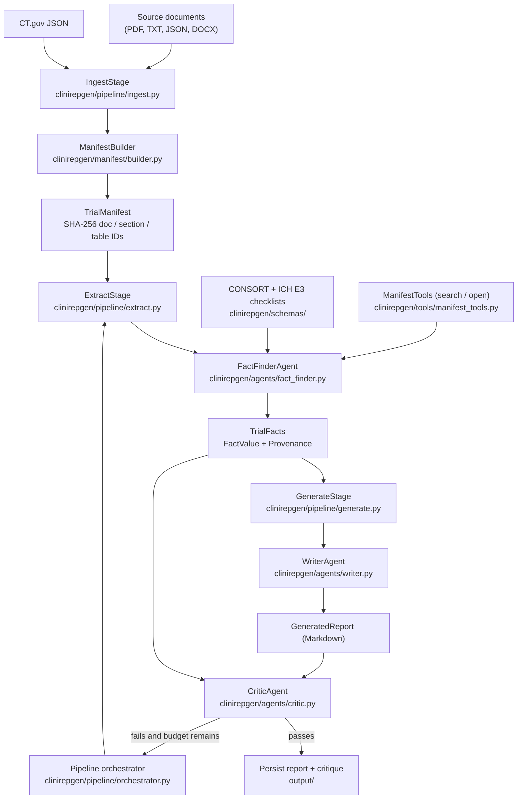

# CliniRepGen

## Purpose

Generate CONSORT 2025 and ICH E3 clinical trial reports from source documents
(ClinicalTrials.gov JSON, protocols, CSRs, PDFs, DOCX). The pipeline builds a
Trial Manifest with deterministic SHA-256 IDs, extracts checklist-driven facts
with provenance, generates narratives with an LLM, and validates them with a
critic loop.

## Files

| Path                                    | Role                                                  |
| --------------------------------------- | ----------------------------------------------------- |
| `clinirepgen/cli.py`                    | Click CLI entry point (`run`, `ingest`, `extract`, `generate`, `demo`, `info`) |
| `clinirepgen/config.py`                 | Env / YAML / JSON configuration loader                |
| `clinirepgen/schemas/`                  | Pydantic models: provenance, trial facts, CONSORT, ICH E3 |
| `clinirepgen/manifest/`                 | Document → manifest builder, section splitter, models |
| `clinirepgen/tools/`                    | Manifest search and access tools used by agents       |
| `clinirepgen/agents/`                   | `FactFinderAgent`, `WriterAgent`, `CriticAgent`, `BaseAgent` |
| `clinirepgen/pipeline/`                 | `IngestStage`, `ExtractStage`, `GenerateStage`, `Pipeline` orchestrator |
| `clinirepgen/reports/`                  | Report templates and Markdown renderer                |
| `sample_data/demo_protocol.txt`         | Sample protocol used by `ingest` and `demo`           |
| `scripts/demo.sh`                       | Non-interactive smoke / full demo script              |
| `pyproject.toml`                        | Package metadata and dependencies                     |
| `requirements.txt`                      | Mirror of runtime dependencies                        |
| `Makefile`                              | `setup`, `install`, `run-demo`, `lint`, `clean`       |

## Entry Points

| Command                                | Purpose                                               |
| -------------------------------------- | ----------------------------------------------------- |
| `clinirepgen demo`                     | Offline demo: builds manifest from synthetic CT.gov data, no API key required |
| `clinirepgen ingest`                   | Build a Trial Manifest from a directory of documents  |
| `clinirepgen extract`                  | Run `FactFinderAgent` over a manifest (requires `API_KEY`) |
| `clinirepgen generate`                 | Run `WriterAgent` (+ optional `CriticAgent`) over facts (requires `API_KEY`) |
| `clinirepgen run`                      | Full pipeline: ingest → extract → generate → critique → iterate |
| `clinirepgen info`                     | Inspect a manifest or facts JSON file                 |
| `make run-demo`                        | Wrapper around `clinirepgen demo`                     |
| `bash scripts/demo.sh`                 | Smoke test (no key) or full demo (with `API_KEY`)     |

## Verification

```bash
python3 -m venv .venv
source .venv/bin/activate
pip install -e .

clinirepgen --version
clinirepgen --help

make run-demo
bash scripts/demo.sh

make lint
```

Expected:

- `clinirepgen --version` prints `clinirepgen, version 0.1.0`.
- `make run-demo` writes `demo_output/demo_manifest.json` with 1 document,
  4 sections, 1 table for trial `NCT00000001`.
- `bash scripts/demo.sh` exits `0` with `SMOKE_OK` when `API_KEY` is unset and
  `DEMO_OK` when `API_KEY` is set.
- `make lint` exits `0` (`ruff` finds no issues in `clinirepgen/`).
- Manifest IDs are reproducible: re-running `clinirepgen demo` produces the same
  `manifest_id`, section IDs, and table IDs for identical input.

Full pipeline (requires `API_KEY` for OpenAI-compatible endpoint):

```bash
export API_KEY="sk-..."
clinirepgen run \
  --trial NCT00000001 \
  --input sample_data/ \
  --out output/
```

## Architecture



The `Pipeline` orchestrator (`clinirepgen/pipeline/orchestrator.py`) iterates
extract → generate → critique up to `PipelineConfig.max_iterations`
(default `3`). Each iteration writes a manifest, facts, report, and critique
artifact to the output directory.

## Configuration

Environment variables consumed by `clinirepgen/config.py` and
`clinirepgen/agents/base.py`:

| Variable                       | Default                       | Used by                  |
| ------------------------------ | ----------------------------- | ------------------------ |
| `API_KEY`                      | (none)                        | OpenAI client            |
| `API_BASE`                     | `https://api.openai.com/v1`   | OpenAI client            |
| `CLINIREPGEN_MODEL`            | `gpt-4o`                      | `AgentConfig`            |
| `CLINIREPGEN_TEMPERATURE`      | `0.0`                         | `Config.from_env`        |
| `CLINIREPGEN_MAX_ITERATIONS`   | `3`                           | `Config.from_env`        |
| `CLINIREPGEN_STRICT`           | `false`                       | `Config.from_env`        |
| `CLINIREPGEN_OUTPUT_DIR`       | `output`                      | `Config.from_env`        |

Optional `config.yaml` / `config.json` is loaded by `get_config()` if present
in the working directory.

## License

Apache License 2.0. See `LICENSE`.
